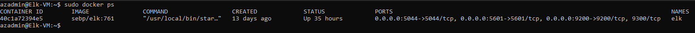

## Automated ELK Stack Deployment

The files in this repository were used to configure the network depicted below.

![TODO: Update the path with the name of your diagram] (Diagrams/Network Diagram.png)

These files have been tested and used to generate a live ELK deployment on Azure. They can be used to either recreate the entire deployment pictured above. Alternatively, select portions of the Elk Playbook file may be used to install only certain pieces of it, such as Filebeat.

  - Elk Playbook.yml

This document contains the following details:
- Description of the Topologu
- Access Policies
- ELK Configuration
  - Beats in Use
  - Machines Being Monitored
- How to Use the Ansible Build

### Description of the Topology

The main purpose of this network is to expose a load-balanced and monitored instance of DVWA, the D*mn Vulnerable Web Application.

Load balancing ensures that the application will be highly available, in addition to restricting access to the network.
- Load balancers protect the system from Denial of Service attacks by diverting traffic from an attack away from corporate servers. A Jump Box is an effective way to give access to multiple web machines from a single node.

Integrating an ELK server allows users to easily monitor the vulnerable VMs for changes to the event logs and system metrics.
- FileBeat watches for  changes in information in the system. 
- MetricBeat records metrics and saves them to desired file.

The configuration details of each machine may be found below.

| Name     | Function | IP Address | Operating System |
|----------|----------|------------|------------------|
| Jump Box | Gateway  | 10.0.0.7   | Linux            |
| Web 1    | Server   | 10.0.0.8   | Linux            |
| Web2     | Server   | 10.0.0.9   | Linux            |
| ELK-VM   | Server   | 10.2.0.4   | Linux            |

### Access Policies

The machines on the internal network are not exposed to the public Internet. 

Only the Load Balancer machine can accept connections from the Internet. Access to this machine is only allowed from the following IP addresses:
- My Public IP

- The Jump Box Provisioner machine is allowed access to the ELK VM. The IP address for that machine is 13.64.17.6 The ELK VM can also be configured through kibana via my personal computer. 

A summary of the access policies in place can be found in the table below.

| Name          | Publicly Accessible | Allowed IP addresses |
|---------------|---------------------|----------------------|
| Jump Box      | YES                 | My Public IP         |
| Load Balancer | YES                 | My Public IP         |
| Web 1         | NO                  | 10.0.0.7             |
| Web 2         | NO                  | 10.0.0.7             |
| ELK VM        | YES                 | 10.0.0.7             |

### Elk Configuration

Ansible was used to automate configuration of the ELK machine. No configuration was performed manually, which is advantageous because...
- Anyone with IT experience can easily set up an Elk machine and write a playbook to fit their needs.

The playbook implements the following tasks:
- Install docker.io 
- Install python3 and Docker Module.
- Increase virtual memory. 
- Launch Docker Elk Container and enable on boot.

The following screenshot displays the result of running `docker ps` after successfully configuring the ELK instance.

### Target Machines & Beats
This ELK server is configured to monitor the following machines:
- Web 1 10.0.0.8 
- Web 2 10.0.0.9 

We have installed the following Beats on these machines:
- FileBeat 
- MetricBeat

These Beats allow us to collect the following information from each machine:

- FileBeat will collect log data, MetricBeat will collect metric data and both forward to Logstash or Elasticsearch. 

- Example of system.syslog message.
  agent.hostname:Web-2 agent.id:998edb77-9268-451b-b478-1efcc8cea4ce agent.type:filebeat agent.ephemeral_id:33ac4820-96ae-4a7e-bce1-ad30a6aef57d agent.version:7.4.0 process.name:filebeat process.pid:1052 log.file.path:/var/log/syslog log.offset:37,650 fileset.name:syslog message:2021-03-02T06:42:41.749Z#011INFO#011[monitoring]#011log/log.go:145#011Non-zero metrics in the last 30s#011{"monitoring": {"metrics": {"beat":{"cpu":{"system":{"ticks":18940,"time":{"ms":4}},"total":{"ticks":44550,"time":{"ms":9},"value":44550},"user":{"ticks":25610,"time":{"ms":5}}},"handles":{"limit":{"hard":4096,"soft":1024},"open":8},"info":{"ephemeral_id":"33ac4820-96ae-4a7e-bce1-ad30a6aef57d","uptime":{"ms":131101964}},"memstats":{"gc_next":8481056,"memory_alloc":7111672,"memory_total":4220523168},"runtime": 

### Using the Playbook
In order to use the playbook, you will need to have an Ansible control node already configured. Assuming you have such a control node provisioned: 

SSH into the control node and follow the steps below:

- Copy the ansible.cfg file to /etc/ansible.
- Update the hosts file to include the private IP addresses of the webservers and the Elk server.
- Run the playbook, and navigate to (Public_IP:5601/app/kibana#/home to check that the installation worked as expected.

